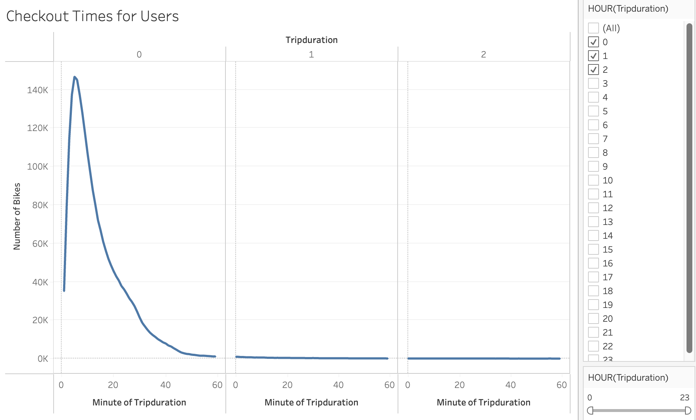
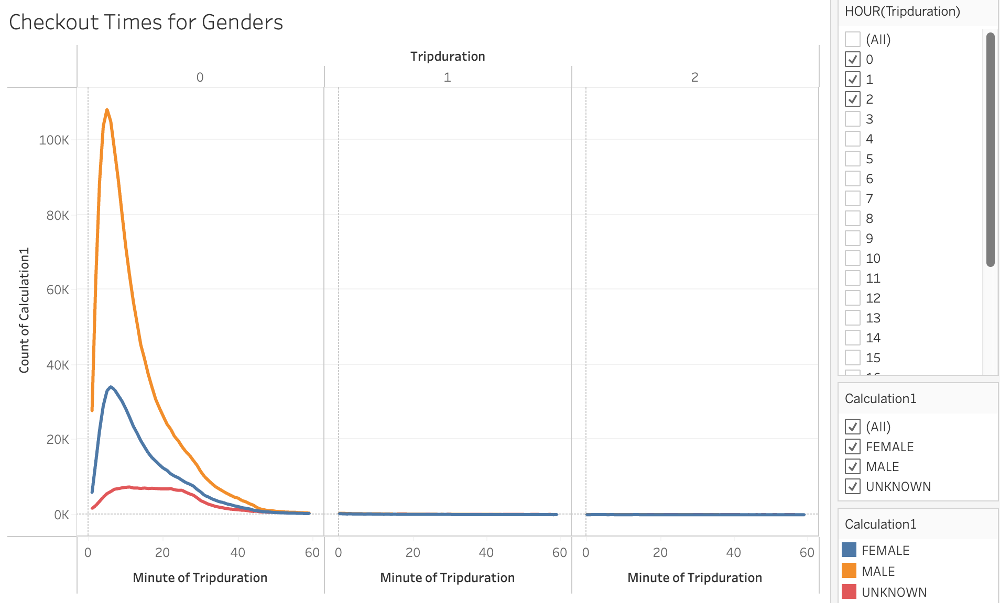
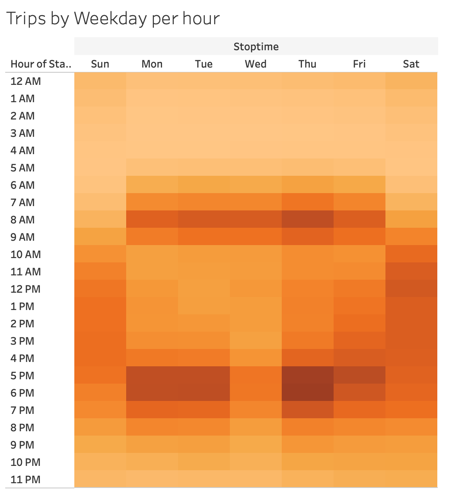
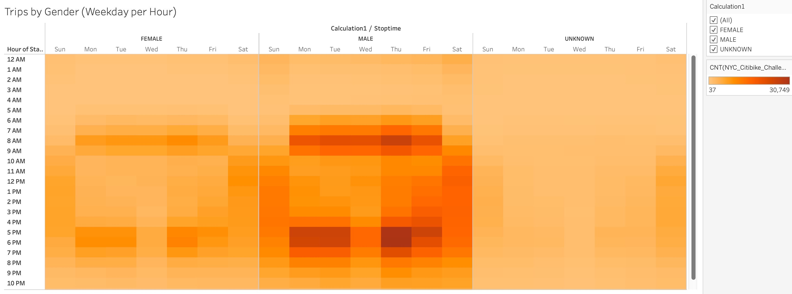
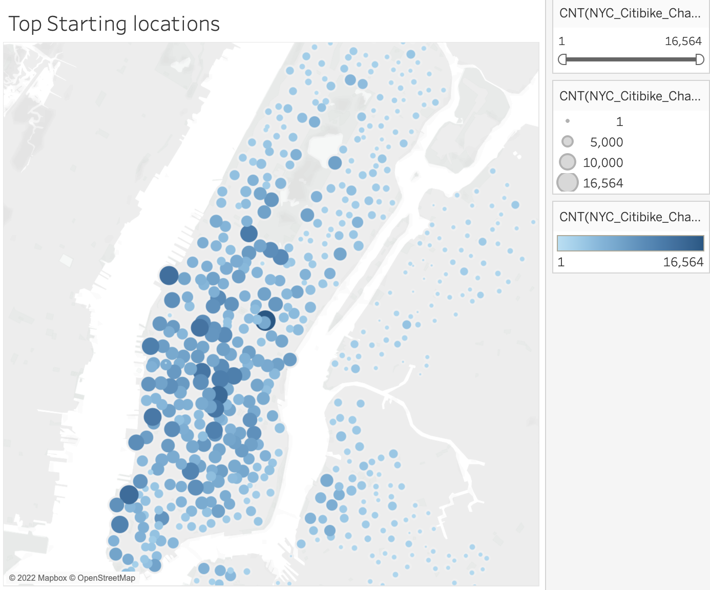
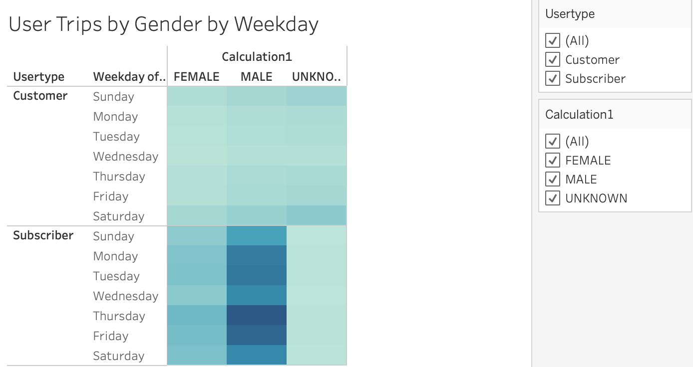
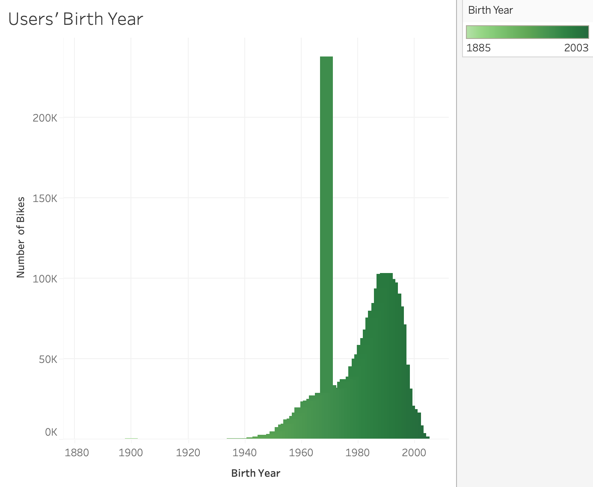

# NYC_Citibike
## Overview of the statistical analysis
The analysis tries to indicate the current condition of the New York City bike-sharing business and perform some guide for Kate to build a similar business in her hometown, Des Moines. The project metrics include the use crowd, workday using hours, and trip duration based on Tableau to display the visualization. [link to dashboard](https://public.tableau.com/app/profile/kylie6599/viz/NYCCityBike_16447784626870/NYCBikes)

## Results

1. The line chart performs that most users ride the bikes at 5 minutes, over 146K people. Moreover, very few users need to spend more than an hour checkout. A portion of people uses the bikes for a long trip(more than one hour). It is interesting that people only ride the bike for 1 minute.

2. Overall, males are the majority share bike users in New York City. Besides, at 5 minutes checkout point, males are triple times fewer people than females. Male and female display an overlapping trend from 59 minutes checkout point.

3. Based on the heatmap, the data perform that most people use bicycles during the commute. The highest volume point on the workday morning is Thursday at 8 am. Compared to Sunday at the same period, Saturday has more people using bikes.

4. This graph shows that females and males have similar stop times. No more than 1,000 females use the bikes from 12 am to 5 am.

5. This map marks the popular places by people to start their bike trips, according to circle colour from light to dark. The deepest blue one is the most popular one.

6. This visualization indicates that customers usually rent the bikes at the weekend, but subscribers always use bikes during the commute. 

7. This graph indicates the user age distribution. The most significant number of users was born in 1969, over 237k. The second most popular birth year of users is 1990.

## Summary

We can figure out several critical factors for the share bike business from the above visualization: trip duration, people's most common usage time for bikes, and user types. Also, males use bikes far more than females, providing basic profit for this service. Third, subscribers always use bikes during their commute, and customers usually use them for weekend pleasure. So we can provide enough bike supply on popular start place at weekday and more on leisure places during the weekend based on specific city situation. 

Two additional visualizations are suggested for future analysis:
1. Top stop locations during the weekend

2. The bike usage time compared with different seasons

